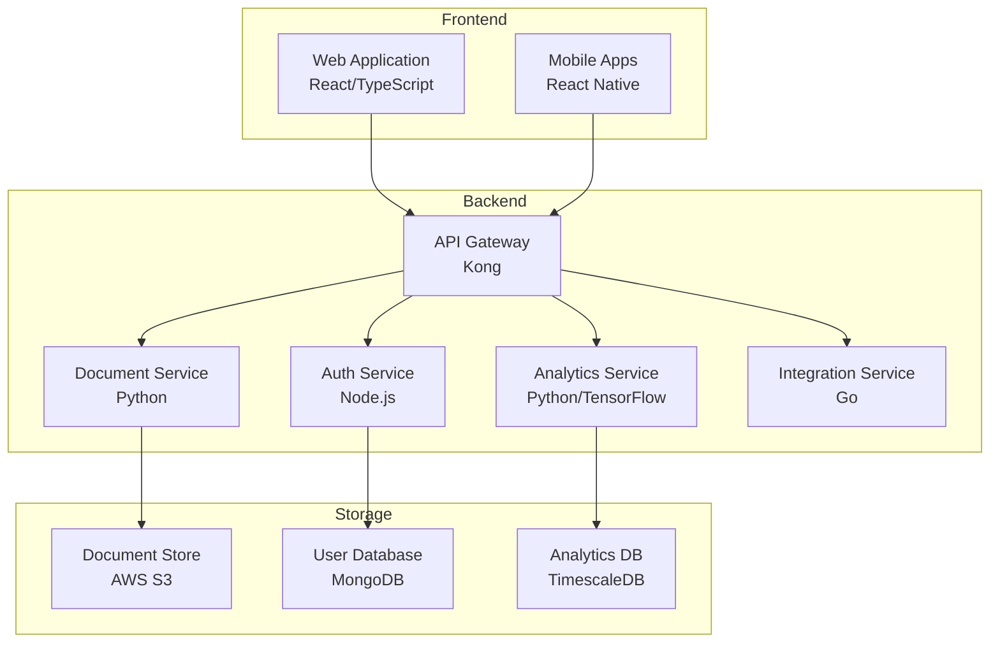
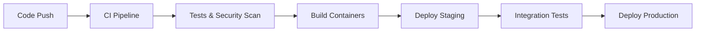
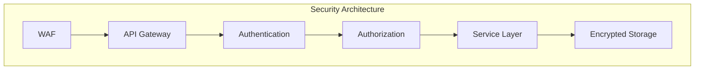

# Personal Health Record Store and Analysis Tool (PHRSAT)


A comprehensive digital health platform revolutionizing personal health data management through secure, centralized storage and AI-driven insights.

## System Overview



## Repository Structure

```
phrsat/
├── src/
│   ├── android/        # React Native Android implementation
│   ├── backend/        # Python/Go microservices
│   ├── ios/            # React Native iOS implementation
│   └── web/            # React/TypeScript web application
├── infrastructure/     # Terraform and Kubernetes configurations
├── docs/              # Technical documentation
└── scripts/           # Development and deployment utilities
```

## Prerequisites

- Docker >= 24.0.0
- Docker Compose >= 2.20.0
- Node.js >= 18.0.0
- Python >= 3.11.0
- Go >= 1.20.0
- Make (latest version)

## Getting Started

1. Clone the repository:
```bash
git clone https://github.com/phrsat/phrsat.git
cd phrsat
```

2. Set up environment variables:
```bash
cp .env.example .env
# Configure environment variables for your setup
```

3. Start development environment:
```bash
make dev
```

4. Access development endpoints:
- Web Application: http://localhost:3000
- API Documentation: http://localhost:8000/docs
- Monitoring Dashboard: http://localhost:9090

## Development Guidelines

### Git Workflow

1. Create feature branch from `develop`:
```bash
git checkout -b feature/your-feature-name
```

2. Commit using conventional commits:
```bash
git commit -m "feat: add health metrics visualization"
```

3. Submit PR to `develop` branch

### Code Standards

- TypeScript: Follow [Google TypeScript Style Guide](https://google.github.io/styleguide/tsguide.html)
- Python: Follow [PEP 8](https://www.python.org/dev/peps/pep-0008/)
- Go: Follow [Effective Go](https://golang.org/doc/effective_go)

### Testing Requirements

- Unit Tests: Minimum 80% coverage
- Integration Tests: Required for all API endpoints
- E2E Tests: Required for critical user flows

## Deployment



### Environment Setup

1. Infrastructure provisioning:
```bash
cd infrastructure
terraform init
terraform apply
```

2. Deploy application:
```bash
make deploy ENV=production
```

### Monitoring

- Application Metrics: Prometheus + Grafana
- Logs: ELK Stack
- Alerts: AlertManager
- Uptime: DataDog

## Security Implementation



### Security Features

- HIPAA-compliant data encryption
- Multi-factor authentication
- Role-based access control
- Audit logging
- Automated security scanning

## Documentation

Detailed documentation available in `/docs`:

- [API Documentation](docs/api/README.md)
- [Architecture Guide](docs/architecture/README.md)
- [Security Guide](docs/security/README.md)
- [Development Guide](docs/development/README.md)
- [Deployment Guide](docs/deployment/README.md)

## Contributing

1. Review [CONTRIBUTING.md](CONTRIBUTING.md)
2. Sign CLA
3. Follow development guidelines
4. Submit PR with comprehensive description

## License

MIT License - see [LICENSE](LICENSE) for details

## Support

- Technical Issues: GitHub Issues
- Security Concerns: security@phrsat.com
- General Inquiries: support@phrsat.com

---
© 2023 PHRSAT. All rights reserved.