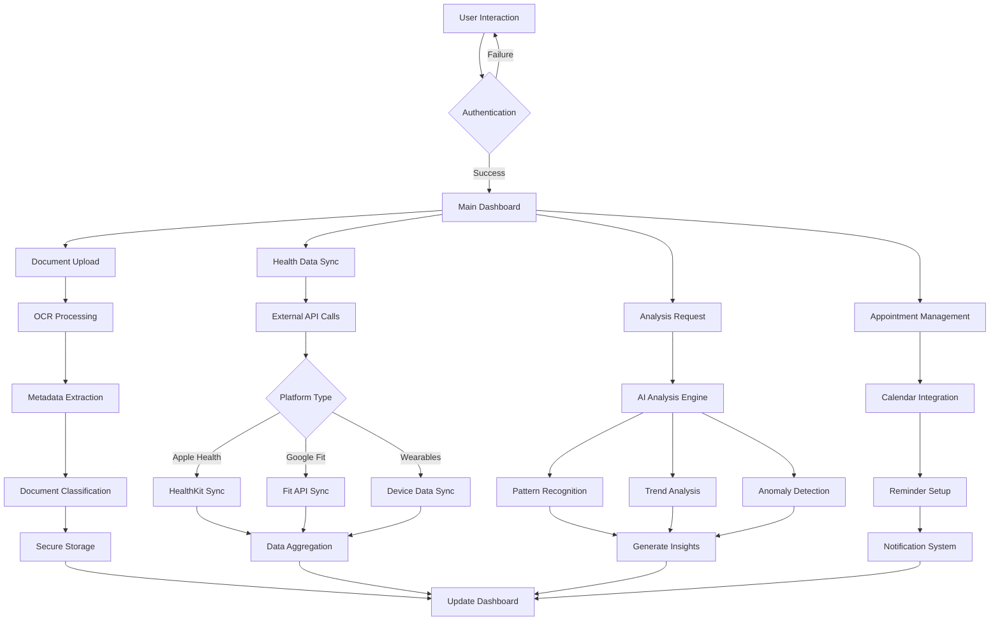
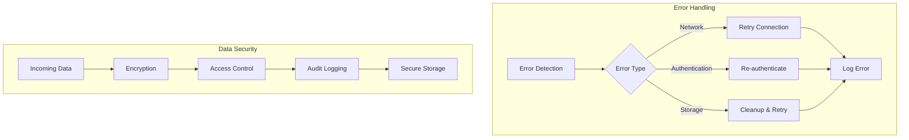
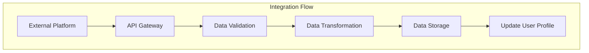
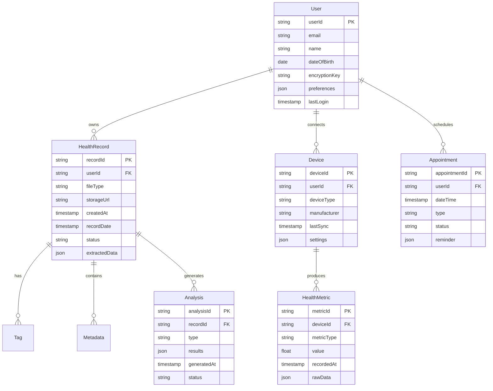
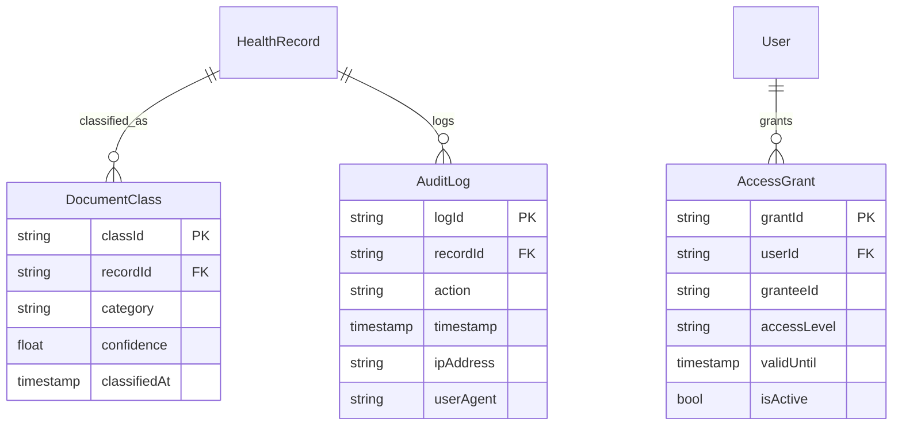
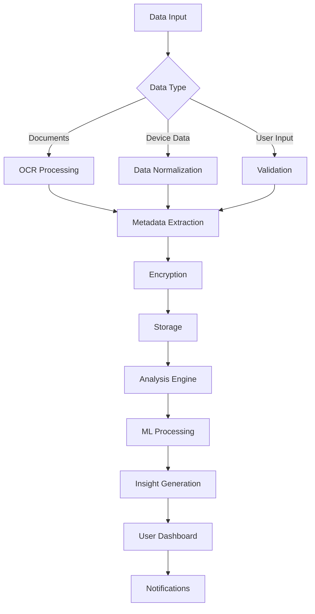

# Product Requirements Document (PRD)

# 1. INTRODUCTION

## 1.1 Purpose

This Software Requirements Specification (SRS) document provides a comprehensive description of the Personal Health Record Store and Analysis Tool (PHRSAT). It details the functional and non-functional requirements, system constraints, and interface specifications necessary for developers, architects, testers, and project stakeholders to successfully implement the system. This document serves as the primary reference for technical and project teams throughout the development lifecycle.

## 1.2 Scope

PHRSAT is a cloud-based health record management and analysis platform designed to:

- Provide secure storage and organization of diverse health records (emails, scans, PDFs, images)
- Implement intelligent document processing using OCR and NLP technologies
- Integrate with external health platforms (iPhone Health, Google Fit, wearable devices)
- Deliver AI-driven health insights and personalized recommendations
- Manage health-related appointments and reminders

### Key Features

1. **Document Management**
   - Multi-format file storage and organization
   - Automated metadata extraction and chronological sorting
   - Cloud-based secure storage infrastructure

2. **Data Analysis**
   - Health record pattern recognition
   - Trend analysis and anomaly detection
   - AI-powered health insights generation

3. **Platform Integration**
   - Apple HealthKit connectivity
   - Google Fit data synchronization
   - Wearable device ecosystem support

4. **Health Monitoring**
   - Customizable health dashboards
   - Appointment scheduling and reminders
   - Calendar system integration

### Benefits

1. **For Users**
   - Centralized health record management
   - Personalized health insights
   - Automated organization and analysis
   - Enhanced health tracking and monitoring

2. **For Healthcare Providers**
   - Comprehensive patient health history
   - Streamlined record access
   - Enhanced patient engagement

3. **For System Administrators**
   - Robust security controls
   - Scalable infrastructure
   - Comprehensive audit capabilities

The system will be developed using React Native and Flutter for mobile applications, Angular/React.js for web interfaces, and cloud services (AWS/Azure/Google Cloud) for backend infrastructure.

# 2. PRODUCT DESCRIPTION

## 2.1 Product Perspective

PHRSAT operates as a standalone cloud-based system that integrates with existing health data ecosystems. The system architecture consists of:

- Mobile applications built with React Native and Flutter
- Web interface developed using Angular/React.js
- Cloud-based backend infrastructure (AWS/Azure/Google Cloud)
- Integration layers for external health platforms and devices
- Secure data storage compliant with healthcare standards


## 2.2 Product Functions

1. **Health Record Management**
   - Document upload and storage
   - Automated metadata extraction and classification
   - OCR processing of physical documents
   - Chronological organization and indexing

2. **Data Integration**
   - Apple HealthKit synchronization
   - Google Fit data aggregation
   - Wearable device data collection
   - External health platform connectivity

3. **Analysis and Insights**
   - Health trend analysis
   - Anomaly detection
   - AI-powered recommendations
   - Personalized health summaries

4. **Appointment Management**
   - Calendar integration
   - Reminder system
   - Scheduling assistance
   - Follow-up tracking

## 2.3 User Characteristics

| User Type | Characteristics | Technical Expertise | Primary Goals |
|-----------|----------------|---------------------|---------------|
| Individual Users | Age: 25-65, Health-conscious, Regular health monitoring | Basic to Intermediate | Personal health tracking, Record organization |
| Healthcare Providers | Medical professionals, Specialists | Intermediate | Patient history review, Data analysis |
| Family Caregivers | Adult children, Spouses | Basic | Managing family health records |
| System Administrators | IT professionals | Advanced | Platform maintenance, Security management |

## 2.4 Constraints

1. **Technical Constraints**
   - Mobile device compatibility requirements
   - Internet connectivity dependency
   - Storage capacity limitations
   - Processing power requirements for AI/ML features

2. **Regulatory Constraints**
   - HIPAA compliance requirements
   - GDPR data protection standards
   - Regional healthcare regulations
   - Data retention policies

3. **Security Constraints**
   - End-to-end encryption requirements
   - Authentication protocols
   - Access control mechanisms
   - Audit trail maintenance

4. **Business Constraints**
   - Development timeline restrictions
   - Budget limitations
   - Resource availability
   - Market competition considerations

## 2.5 Assumptions and Dependencies

### Assumptions
1. Users have consistent internet access
2. Mobile devices meet minimum system requirements
3. Users maintain active accounts on integrated platforms
4. Healthcare providers support digital record sharing

### Dependencies
1. **External Services**
   - Cloud service providers' availability
   - Third-party API stability
   - OCR/NLP service reliability
   - Payment gateway services

2. **Technical Dependencies**
   - Mobile OS compatibility
   - Browser support
   - Database scalability
   - Network infrastructure

3. **Business Dependencies**
   - Partner healthcare systems
   - Wearable device manufacturers
   - Health data platforms
   - Regulatory compliance certifications

# 3. PROCESS FLOWCHART







# 4. FUNCTIONAL REQUIREMENTS

## 4.1 Document Management System

### ID: FR-DMS-001
**Description:** Multi-format health record upload and storage system  
**Priority:** High

| Requirement ID | Requirement Description | Acceptance Criteria |
|---------------|------------------------|-------------------|
| DMS-001.1 | Support upload of PDF, JPEG, PNG, DOC, DOCX, and EML file formats | All specified formats successfully upload and display |
| DMS-001.2 | Implement OCR processing for scanned documents | Text extraction accuracy > 95% |
| DMS-001.3 | Automatic metadata extraction from documents | Date, type, and source correctly identified |
| DMS-001.4 | Chronological organization of records | Documents sorted by date with timeline view |

### ID: FR-DMS-002
**Description:** Document classification and tagging system  
**Priority:** Medium

| Requirement ID | Requirement Description | Acceptance Criteria |
|---------------|------------------------|-------------------|
| DMS-002.1 | AI-powered document type classification | Correct categorization of >90% of documents |
| DMS-002.2 | Automated tagging based on content | Relevant tags generated for each document |
| DMS-002.3 | Manual tag editing capabilities | Users can add, modify, or remove tags |
| DMS-002.4 | Hierarchical folder organization | Custom folder creation and document filing |

## 4.2 Health Data Integration

### ID: FR-HDI-001
**Description:** External platform data synchronization  
**Priority:** High

| Requirement ID | Requirement Description | Acceptance Criteria |
|---------------|------------------------|-------------------|
| HDI-001.1 | Apple HealthKit integration | Real-time sync of all HealthKit metrics |
| HDI-001.2 | Google Fit API integration | Successful sync of activity and fitness data |
| HDI-001.3 | Wearable device data collection | Support for major wearable brands |
| HDI-001.4 | Data normalization and standardization | Consistent format across all data sources |

### ID: FR-HDI-002
**Description:** Health data aggregation and visualization  
**Priority:** Medium

| Requirement ID | Requirement Description | Acceptance Criteria |
|---------------|------------------------|-------------------|
| HDI-002.1 | Customizable health dashboards | User-configurable metric displays |
| HDI-002.2 | Interactive data visualization | Zoomable charts and graphs |
| HDI-002.3 | Cross-platform data correlation | Combined views of multiple data sources |
| HDI-002.4 | Export functionality | Data export in CSV and PDF formats |

## 4.3 Analysis and Insights Engine

### ID: FR-AIE-001
**Description:** AI-powered health analysis system  
**Priority:** High

| Requirement ID | Requirement Description | Acceptance Criteria |
|---------------|------------------------|-------------------|
| AIE-001.1 | Health trend analysis | Detection of significant patterns |
| AIE-001.2 | Anomaly detection | Alert generation for unusual patterns |
| AIE-001.3 | Predictive health modeling | Forward-looking health projections |
| AIE-001.4 | Personalized health insights | User-specific recommendations |

### ID: FR-AIE-002
**Description:** Health report generation  
**Priority:** Medium

| Requirement ID | Requirement Description | Acceptance Criteria |
|---------------|------------------------|-------------------|
| AIE-002.1 | Automated health summaries | Monthly/quarterly report generation |
| AIE-002.2 | Custom report creation | User-defined report parameters |
| AIE-002.3 | Multi-format export options | PDF, HTML, and mobile-friendly formats |
| AIE-002.4 | Share functionality | Secure sharing with healthcare providers |

## 4.4 Appointment Management

### ID: FR-APM-001
**Description:** Calendar integration and reminder system  
**Priority:** Medium

| Requirement ID | Requirement Description | Acceptance Criteria |
|---------------|------------------------|-------------------|
| APM-001.1 | Calendar sync with device | Two-way sync with native calendars |
| APM-001.2 | Appointment scheduling | Direct scheduling with reminder creation |
| APM-001.3 | Custom reminder settings | User-defined notification preferences |
| APM-001.4 | Follow-up tracking | Automated follow-up reminders |

### ID: FR-APM-002
**Description:** Health event management  
**Priority:** Low

| Requirement ID | Requirement Description | Acceptance Criteria |
|---------------|------------------------|-------------------|
| APM-002.1 | Medication reminders | Configurable medication schedules |
| APM-002.2 | Recurring appointment setup | Pattern-based appointment creation |
| APM-002.3 | Healthcare provider directory | Searchable provider database |
| APM-002.4 | Appointment history tracking | Complete appointment audit trail |

# 5. NON-FUNCTIONAL REQUIREMENTS

## 5.1 Performance Requirements

| Requirement ID | Description | Target Metric |
|---------------|-------------|---------------|
| NFR-PER-001 | API Response Time | 95% of requests < 500ms |
| NFR-PER-002 | Document Upload Speed | Support 50MB files within 30 seconds |
| NFR-PER-003 | Search Response Time | Results displayed within 2 seconds |
| NFR-PER-004 | Concurrent Users | Support 10,000 simultaneous users |
| NFR-PER-005 | Mobile App Launch Time | < 3 seconds on 4G networks |
| NFR-PER-006 | Database Query Performance | 99% of queries < 100ms |
| NFR-PER-007 | OCR Processing Time | < 60 seconds for 10-page document |

## 5.2 Safety Requirements

| Requirement ID | Description | Implementation |
|---------------|-------------|----------------|
| NFR-SAF-001 | Data Backup | Automated daily backups with 30-day retention |
| NFR-SAF-002 | Disaster Recovery | Recovery Time Objective (RTO) < 4 hours |
| NFR-SAF-003 | Data Redundancy | Geographic redundancy across 3 regions |
| NFR-SAF-004 | Failover Systems | Automatic failover with zero data loss |
| NFR-SAF-005 | Error Handling | Graceful degradation of services |
| NFR-SAF-006 | Data Validation | Input validation for all user-submitted data |

## 5.3 Security Requirements

| Requirement ID | Description | Specification |
|---------------|-------------|---------------|
| NFR-SEC-001 | Authentication | Multi-factor authentication (MFA) |
| NFR-SEC-002 | Data Encryption | AES-256 encryption at rest and in transit |
| NFR-SEC-003 | Access Control | Role-based access control (RBAC) |
| NFR-SEC-004 | Session Management | 30-minute session timeout |
| NFR-SEC-005 | Audit Logging | Complete audit trail of all data access |
| NFR-SEC-006 | Penetration Testing | Quarterly security assessments |
| NFR-SEC-007 | API Security | OAuth 2.0 and JWT implementation |

## 5.4 Quality Requirements

### 5.4.1 Availability
- System uptime: 99.9% (excluding planned maintenance)
- Planned maintenance windows: Monthly, < 4 hours
- Maximum unplanned downtime: 8 hours/year

### 5.4.2 Maintainability
- Modular architecture using React/Angular components
- Automated deployment pipelines
- Comprehensive API documentation
- Code coverage > 80%

### 5.4.3 Usability
- Mobile-first responsive design
- Maximum 3 clicks to reach any feature
- Support for accessibility standards (WCAG 2.1)
- Multi-language support (English, Spanish, French)

### 5.4.4 Scalability
- Horizontal scaling capability
- Auto-scaling based on load
- Support for 100% annual user growth
- Storage scalability up to 10TB per user

### 5.4.5 Reliability
- Mean Time Between Failures (MTBF): > 720 hours
- Mean Time To Recovery (MTTR): < 1 hour
- Error rate: < 0.1% of all transactions
- Data integrity verification systems

## 5.5 Compliance Requirements

| Requirement ID | Standard/Regulation | Implementation Requirements |
|---------------|---------------------|---------------------------|
| NFR-COM-001 | HIPAA | - PHI encryption<br>- Access controls<br>- Audit trails<br>- Business Associate Agreements |
| NFR-COM-002 | GDPR | - Data privacy controls<br>- Right to be forgotten<br>- Data portability<br>- Consent management |
| NFR-COM-003 | HITECH | - Security breach notifications<br>- Electronic health record standards |
| NFR-COM-004 | ISO 27001 | - Information security management<br>- Risk assessment<br>- Security controls |
| NFR-COM-005 | SOC 2 Type II | - Security<br>- Availability<br>- Processing integrity<br>- Confidentiality<br>- Privacy |
| NFR-COM-006 | FDA 21 CFR Part 11 | - Electronic signatures<br>- Audit trails<br>- System validations |

# 6. DATA REQUIREMENTS

## 6.1 Data Models

### 6.1.1 Core Entities



### 6.1.2 Supporting Entities



## 6.2 Data Storage

### 6.2.1 Storage Requirements

| Data Type | Storage System | Retention Period | Backup Frequency |
|-----------|---------------|------------------|------------------|
| Health Records | AWS S3/Azure Blob | 7 years | Daily |
| User Metadata | MongoDB Atlas | Account lifetime | Hourly |
| Analytics Data | Amazon Redshift | 2 years | Daily |
| Audit Logs | Elasticsearch | 3 years | Daily |
| Device Data | TimescaleDB | 1 year | Hourly |

### 6.2.2 Data Redundancy

- Primary storage in main region
- Cross-region replication to two secondary regions
- Multi-AZ deployment for database systems
- 99.999% durability guarantee for all stored data

### 6.2.3 Backup Strategy

- Automated daily full backups
- Continuous incremental backups
- 30-day backup retention
- Monthly archive to cold storage
- Quarterly backup verification tests

## 6.3 Data Processing

### 6.3.1 Data Flow



### 6.3.2 Data Security Measures

| Security Layer | Implementation |
|----------------|----------------|
| Encryption at Rest | AES-256 encryption |
| Encryption in Transit | TLS 1.3 |
| Access Control | RBAC with JWT tokens |
| Data Masking | PHI/PII field encryption |
| Key Management | AWS KMS/Azure Key Vault |

### 6.3.3 Data Processing Requirements

- Real-time processing for device data streams
- Batch processing for document analysis
- Asynchronous processing for ML operations
- Event-driven architecture for notifications
- Rate limiting for API endpoints

### 6.3.4 Data Quality Controls

- Input validation for all data sources
- Data format standardization
- Duplicate detection and resolution
- Data integrity checks
- Automated data cleansing
- Quality scoring for ML inputs

# 7. EXTERNAL INTERFACES

## 7.1 User Interfaces

### 7.1.1 Web Application Interface

| Component | Requirements |
|-----------|-------------|
| Framework | React.js/Angular with Material UI |
| Responsive Design | Bootstrap 5 breakpoints (xs, sm, md, lg, xl) |
| Accessibility | WCAG 2.1 Level AA compliance |
| Supported Browsers | Chrome 90+, Firefox 88+, Safari 14+, Edge 90+ |
| Minimum Resolution | 320px (mobile) to 4K displays |


### 7.1.2 Mobile Application Interface

| Component | Requirements |
|-----------|-------------|
| Framework | React Native/Flutter |
| Design System | Material Design 3.0/iOS Human Interface |
| Minimum OS Version | iOS 14+, Android 10+ |
| Screen Orientations | Portrait and Landscape |
| Touch Interactions | Multi-touch gestures, haptic feedback |


## 7.2 Hardware Interfaces

### 7.2.1 Wearable Devices

| Device Type | Interface Specifications |
|-------------|------------------------|
| Smartwatches | Bluetooth 5.0 LE, NFC |
| Fitness Trackers | BLE GATT profiles |
| Medical Devices | USB 2.0/3.0, Bluetooth |
| Biometric Sensors | I2C, SPI protocols |

### 7.2.2 Mobile Devices

| Component | Specification |
|-----------|--------------|
| Camera | Min. 8MP for document scanning |
| Storage | 100MB free space minimum |
| Processor | ARM v8 64-bit or equivalent |
| Memory | 2GB RAM minimum |

## 7.3 Software Interfaces

### 7.3.1 Health Platform Integration

| Platform | Interface Type | Data Format |
|----------|---------------|-------------|
| Apple HealthKit | Native API | HealthKit XML |
| Google Fit | REST API | JSON |
| Fitbit | OAuth 2.0 API | JSON |
| Garmin | REST API | FIT/JSON |

### 7.3.2 Cloud Services

| Service | Interface Specification |
|---------|----------------------|
| AWS S3 | AWS SDK, REST API |
| Azure Blob | Azure SDK, REST API |
| MongoDB Atlas | MongoDB Driver 4.0+ |
| Elasticsearch | Elasticsearch REST API |

### 7.3.3 Third-Party Services

| Service | Integration Method |
|---------|-------------------|
| OCR Processing | Google Cloud Vision API |
| NLP Services | AWS Comprehend Medical |
| Calendar Systems | CalDAV, iCal |
| Payment Gateway | Stripe API v2022-11-15 |

## 7.4 Communication Interfaces

### 7.4.1 Network Protocols

| Protocol | Usage | Specification |
|----------|-------|--------------|
| HTTPS | API Communication | TLS 1.3 |
| WebSocket | Real-time Updates | WSS Protocol |
| MQTT | Device Data Streaming | MQTT 5.0 |
| gRPC | Internal Services | HTTP/2 |

### 7.4.2 API Specifications

```yaml
OpenAPI: 3.0.0
Endpoints:
  - /api/v1/health-records
  - /api/v1/devices
  - /api/v1/analytics
  - /api/v1/appointments
Security:
  - OAuth2
  - JWT
Content-Type:
  - application/json
  - multipart/form-data
```

### 7.4.3 Data Exchange Formats

| Format | Usage | Schema |
|--------|-------|--------|
| JSON | API Responses | JSON Schema 2020-12 |
| HL7 FHIR | Health Data | FHIR R4 |
| DICOM | Medical Imaging | DICOM 3.0 |
| XML | Legacy Systems | XML 1.0 |

# 8. APPENDICES

## 8.1 GLOSSARY

| Term | Definition |
|------|------------|
| Health Record | Any document or data containing medical information about a user |
| Metadata | Supporting information about a record such as date, type, and source |
| OCR | Technology that converts images of text into machine-readable text |
| PHI | Protected Health Information - any information about health status, care, or payment |
| Wearable Device | Electronic devices worn on the body that collect health and fitness data |
| Health Metric | A measurable value related to health status (e.g., heart rate, steps) |
| Machine Learning Model | Algorithm-based system that learns from data to make predictions or classifications |
| Data Lake | Storage repository that holds raw data in its native format |
| Health Insight | Actionable information derived from analysis of health data |
| Role-Based Access | Security model where system access is based on user roles |

## 8.2 ACRONYMS

| Acronym | Expansion |
|---------|-----------|
| PHRSAT | Personal Health Record Store and Analysis Tool |
| API | Application Programming Interface |
| HIPAA | Health Insurance Portability and Accountability Act |
| GDPR | General Data Protection Regulation |
| HITECH | Health Information Technology for Economic and Clinical Health Act |
| JWT | JSON Web Token |
| RBAC | Role-Based Access Control |
| FHIR | Fast Healthcare Interoperability Resources |
| DICOM | Digital Imaging and Communications in Medicine |
| NLP | Natural Language Processing |
| BLE | Bluetooth Low Energy |
| GATT | Generic Attribute Profile |
| WSS | WebSocket Secure |
| MQTT | Message Queuing Telemetry Transport |

## 8.3 ADDITIONAL REFERENCES

| Reference | Description | URL |
|-----------|-------------|-----|
| HL7 FHIR Documentation | Healthcare data exchange standard specifications | https://www.hl7.org/fhir/ |
| Apple HealthKit | Documentation for Apple health data integration | https://developer.apple.com/health-fitness/ |
| Google Fit REST API | Reference for Google Fit integration | https://developers.google.com/fit |
| HIPAA Security Rule | Technical safeguards for health data | https://www.hhs.gov/hipaa/for-professionals/security |
| OAuth 2.0 Specification | Authentication protocol documentation | https://oauth.net/2/ |
| React Native Documentation | Mobile development framework reference | https://reactnative.dev/docs |
| Flutter Documentation | Cross-platform development framework | https://flutter.dev/docs |
| AWS Healthcare Solutions | Cloud infrastructure guidelines | https://aws.amazon.com/health/ |
| WCAG 2.1 Guidelines | Web accessibility standards | https://www.w3.org/WAI/standards-guidelines/wcag/ |

## 8.4 REVISION HISTORY

| Version | Date | Author | Description of Changes |
|---------|------|--------|----------------------|
| 1.0 | Initial Release | Product Team | Base document creation |
| 1.1 | Update | Development Team | Added technical specifications |
| 1.2 | Update | Security Team | Enhanced security requirements |
| 1.3 | Update | Integration Team | Added external interfaces |
| 1.4 | Update | QA Team | Updated testing requirements |