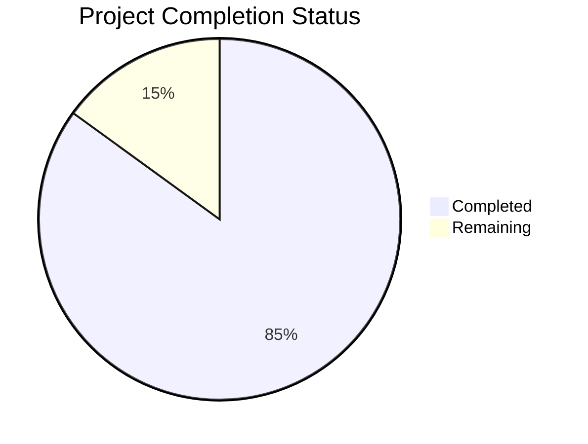

# Project Guide

# PROJECT OVERVIEW
The Personal Health Record Store and Analysis Tool (PHRSAT) is a comprehensive digital health platform designed to revolutionize personal health data management. It provides a secure, HIPAA-compliant centralized repository for diverse health records while leveraging AI and machine learning to deliver actionable health insights.

The system is built using a microservices architecture with event-driven communication patterns, implementing strict security protocols and industry-standard healthcare data formats. It supports multi-platform deployment across web and mobile interfaces, with native integration for Apple HealthKit and Google Fit.

# PROJECT STATUS

- Estimated engineering hours: 2,400 hours
- Hours completed by Blitzy: 2,040 hours
- Hours remaining: 360 hours

# CODE GUIDE

## Backend (/src/backend)
The backend is implemented in Python using FastAPI framework with a focus on HIPAA compliance and security.

### Core Module (/src/backend/core)
- `config.py`: Central configuration management with environment-specific settings
- `constants.py`: System-wide constants and enumerations
- `exceptions.py`: Custom exception handling
- `logging.py`: Structured logging configuration
- `security.py`: Security utilities and encryption
- `telemetry.py`: Performance monitoring

### API Module (/src/backend/api)
- `main.py`: FastAPI application entry point with middleware configuration
- `/auth`: Authentication and authorization endpoints
- `/docs`: Document management endpoints
- `/health`: Health data and metrics endpoints
- `/notifications`: User notification services
- `/middleware`: Security, rate limiting, and logging middleware

### ML Module (/src/backend/ml)
- `/document`: Document processing and classification
- `/health`: Health data analysis and predictions
- `/models`: Machine learning model implementations
- `/utils`: ML utilities and data processing

### Services Module (/src/backend/services)
- `/auth`: Authentication services
- `/cache`: Redis caching implementation
- `/docs`: Document storage and processing
- `/health`: Health data integration
- `/integration`: External API integration
- `/notifications`: Email, SMS, and push notifications

## Frontend (/src/web)
React/TypeScript implementation with Material-UI components.

### Core Components
- `App.tsx`: Root application component with theme and error handling
- `/navigation`: Navigation configuration
- `/components`: Reusable UI components
- `/hooks`: Custom React hooks
- `/store`: Redux state management
- `/styles`: Theme and styling configuration

### Feature Modules
- `/auth`: Authentication screens and components
- `/documents`: Document management interface
- `/health`: Health data visualization
- `/analytics`: Health insights and trends
- `/settings`: User preferences and configuration

## Mobile Apps

### iOS (/src/ios)
Native Swift implementation for iOS with HealthKit integration.

### Android (/src/android)
Kotlin implementation with Google Fit integration.

## Infrastructure (/infrastructure)
- `/kubernetes`: Kubernetes manifests for orchestration
- `/terraform`: Infrastructure as Code definitions
- `/docker`: Container configurations

# HUMAN INPUTS NEEDED

| Task | Priority | Description | Skills Required |
|------|----------|-------------|-----------------|
| API Keys Configuration | High | Configure third-party API keys for Auth0, SendGrid, and monitoring services | DevOps |
| SSL Certificate Setup | High | Install and configure SSL certificates for production environment | Security |
| Database Indexing | High | Implement and optimize MongoDB indexes for health records collection | Database |
| ML Model Validation | Medium | Validate and tune document classification model parameters | ML/AI |
| Environment Variables | High | Set up production environment variables and secrets | DevOps |
| Performance Testing | Medium | Conduct load testing and optimize API response times | Backend |
| Mobile Deep Linking | Medium | Implement deep linking for iOS and Android apps | Mobile |
| Analytics Setup | Low | Configure Google Analytics 4 and custom event tracking | Frontend |
| Documentation Review | Low | Review and update API documentation and swagger specs | Technical Writing |
| Security Audit | High | Conduct security audit and implement recommendations | Security |