# Technical Specifications

# 1. INTRODUCTION

## 1.1 EXECUTIVE SUMMARY

The Personal Health Record Store and Analysis Tool (PHRSAT) is a comprehensive digital health platform designed to revolutionize personal health data management. The system addresses the critical challenge of fragmented health information by providing a secure, centralized repository for diverse health records while leveraging AI and machine learning to deliver actionable health insights.

This solution serves healthcare-conscious individuals, family caregivers, and healthcare providers by consolidating medical documents, fitness data, and health metrics into an intelligent platform that enables proactive health management and informed decision-making.

## 1.2 SYSTEM OVERVIEW

### Project Context

| Aspect | Description |
|--------|-------------|
| Market Position | Premium personal health management platform targeting health-conscious individuals and digital health enthusiasts |
| Current Limitations | Fragmented health records, manual organization, lack of intelligent analysis |
| Enterprise Integration | Seamless integration with existing healthcare systems, wearables, and fitness platforms |

### High-Level Description

| Component | Implementation |
|-----------|---------------|
| Document Management | Cloud-based storage with OCR and intelligent classification |
| Data Integration | API-driven synchronization with health platforms and devices |
| Analysis Engine | AI/ML-powered health trend analysis and insights generation |
| Security Framework | HIPAA-compliant encryption and access control system |

### Success Criteria

| Metric | Target |
|--------|--------|
| User Adoption | 100,000 active users within 12 months |
| Data Processing | 95% accuracy in document classification |
| System Uptime | 99.9% availability excluding maintenance |
| User Satisfaction | 4.5/5 average user rating |

## 1.3 SCOPE

### In-Scope Elements

#### Core Features

- Multi-format health record storage and organization
- Automated document processing and classification
- Health platform integration (Apple Health, Google Fit)
- AI-driven health analysis and insights
- Appointment and reminder management
- Mobile and web application interfaces

#### Implementation Boundaries

| Boundary Type | Coverage |
|--------------|----------|
| User Groups | Individual users, family caregivers, healthcare providers |
| Geographic Coverage | North America, Europe (Phase 1) |
| Data Domains | Medical records, fitness data, health metrics, appointments |
| Device Support | iOS, Android, major web browsers |

### Out-of-Scope Elements

- Direct telemedicine services
- Medical billing and insurance processing
- Prescription management and fulfillment
- Emergency response systems
- Clinical decision support
- Medical device control interfaces
- Real-time vital monitoring
- Third-party marketplace integration

# 2. SYSTEM ARCHITECTURE

## 2.1 High-Level Architecture

The PHRSAT system follows a microservices architecture pattern with event-driven communication for scalability and maintainability.

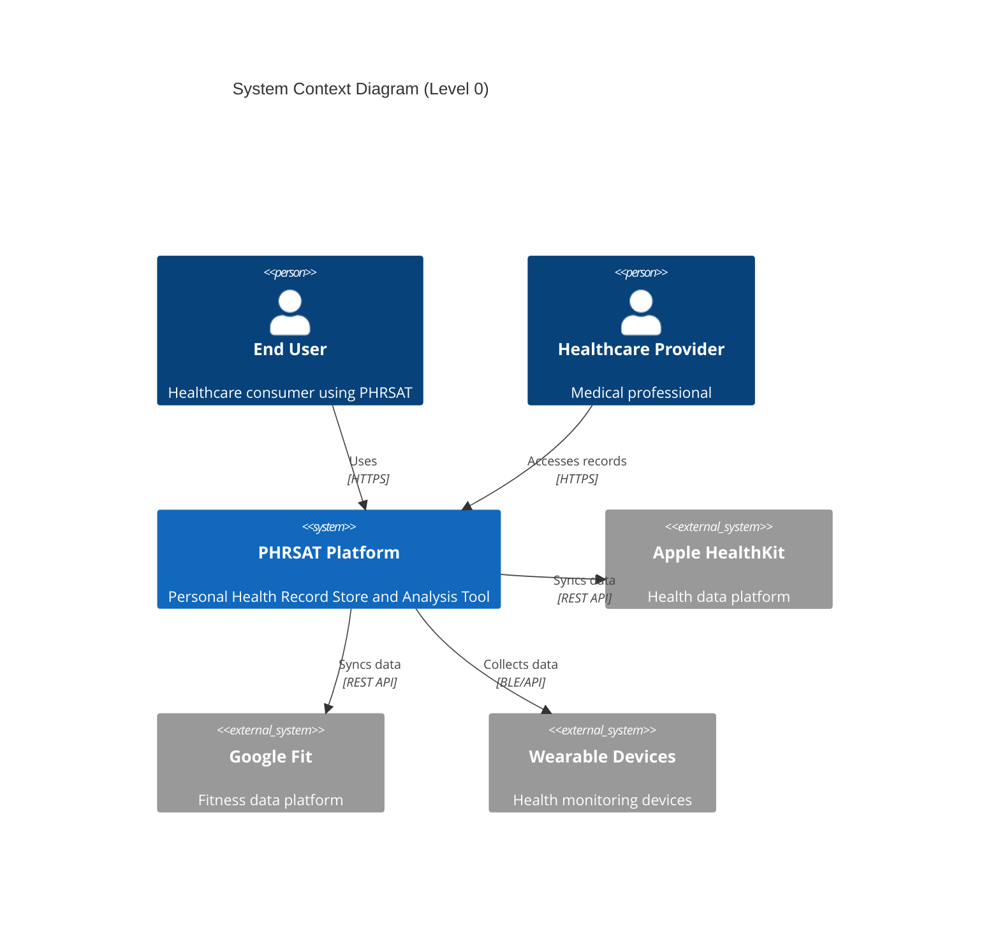

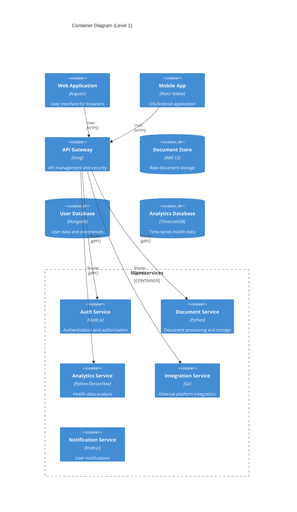

## 2.2 Component Details

### 2.2.1 Core Services

| Service | Technology Stack | Purpose | Scaling Strategy |
|---------|-----------------|---------|------------------|
| API Gateway | Kong, Nginx | Request routing, rate limiting | Horizontal with load balancer |
| Auth Service | Node.js, JWT | User authentication, RBAC | Horizontal with session store |
| Document Service | Python, FastAPI | Document processing, OCR | Vertical for memory-intensive tasks |
| Analytics Service | Python, TensorFlow | Health data analysis | GPU-optimized instances |
| Integration Service | Go | External API integration | Horizontal with connection pooling |

### 2.2.2 Data Storage Solutions

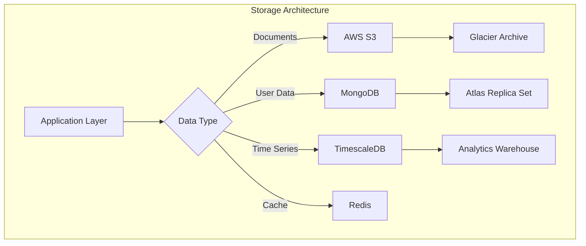

## 2.3 Technical Decisions

### 2.3.1 Architecture Patterns

| Pattern | Implementation | Justification |
|---------|----------------|---------------|
| Microservices | Domain-driven services | Scalability, team autonomy |
| Event-driven | Apache Kafka | Asynchronous processing, decoupling |
| CQRS | Separate read/write paths | Performance optimization |
| API Gateway | Kong | Security, monitoring, rate limiting |

### 2.3.2 Communication Patterns

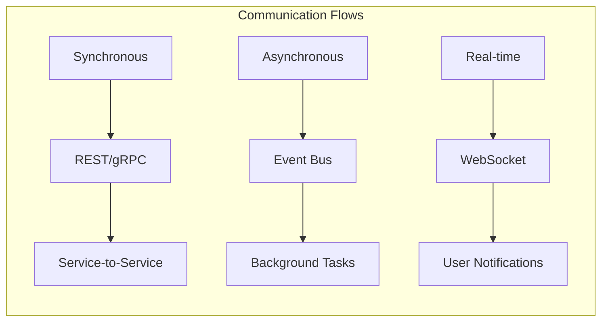

## 2.4 Cross-Cutting Concerns

### 2.4.1 Monitoring and Observability

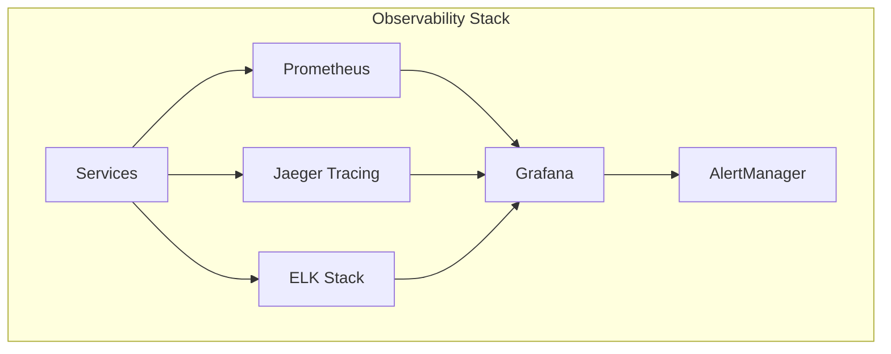

### 2.4.2 Security Architecture

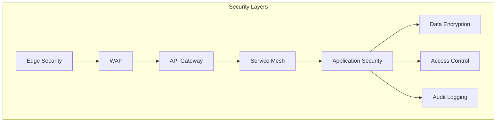

## 2.5 Deployment Architecture

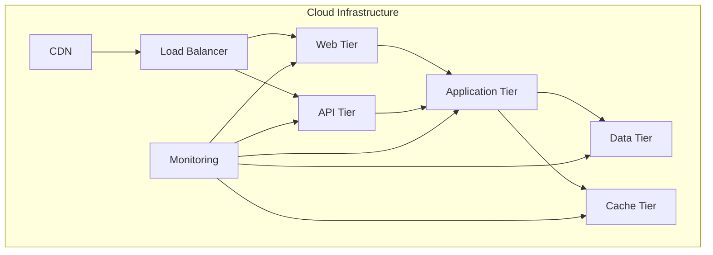

### 2.5.1 Infrastructure Requirements

| Component | Specification | Scaling Limits |
|-----------|--------------|----------------|
| Web Tier | t3.large | Auto-scale 2-10 instances |
| API Tier | c5.xlarge | Auto-scale 3-15 instances |
| Application Tier | r5.2xlarge | Auto-scale 4-20 instances |
| Database Tier | db.r5.2xlarge | Multi-AZ with read replicas |
| Cache Tier | cache.r5.large | Cluster mode enabled |

### 2.5.2 Disaster Recovery

| Aspect | Strategy | RPO | RTO |
|--------|----------|-----|-----|
| Data Backup | Continuous replication | 5 minutes | N/A |
| Service Recovery | Multi-region active-passive | N/A | 4 hours |
| Network Recovery | Redundant connectivity | N/A | 5 minutes |
| Application Recovery | Blue-green deployment | N/A | 15 minutes |

# 3. SYSTEM COMPONENTS ARCHITECTURE

## 3.1 USER INTERFACE DESIGN

### 3.1.1 Design System Specifications

| Component | Specification | Implementation |
|-----------|--------------|----------------|
| Typography | Roboto/SF Pro | Primary: 16px, Headers: 24-48px |
| Color Palette | Primary: #2196F3, Secondary: #4CAF50 | WCAG 2.1 AAA compliant |
| Grid System | 12-column fluid grid | Breakpoints: 320px, 768px, 1024px, 1440px |
| Spacing | 8px base unit | Increments: 8px, 16px, 24px, 32px, 48px |
| Iconography | Material Icons/SF Symbols | SVG with PNG fallback |
| Dark Mode | Auto-switching based on OS | Separate color tokens for modes |

### 3.1.2 Component Library

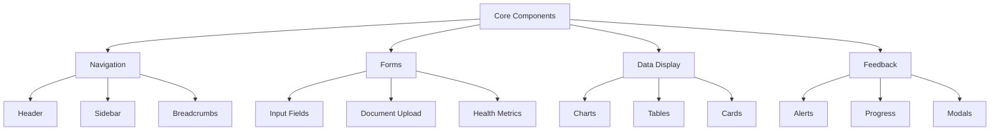

### 3.1.3 Critical User Flows

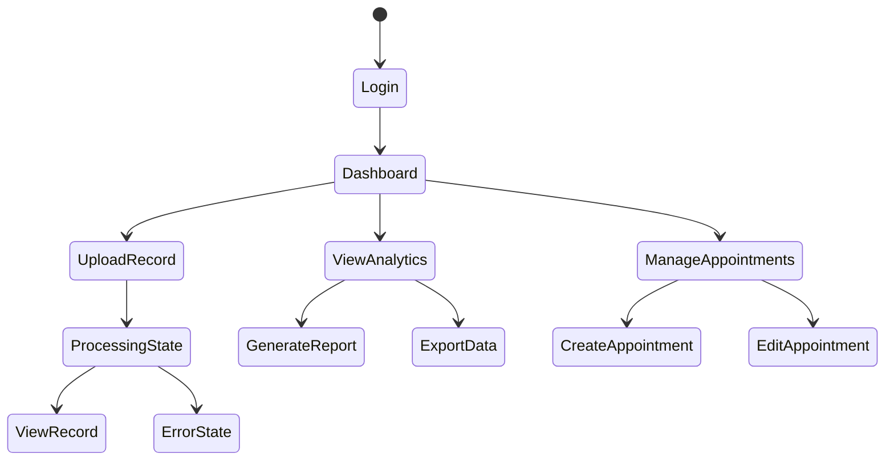

### 3.1.4 Responsive Design Matrix

| Breakpoint | Layout | Navigation | Component Behavior |
|------------|--------|------------|-------------------|
| Mobile (<768px) | Single column | Bottom bar | Stack all components |
| Tablet (768-1024px) | 2-column grid | Side drawer | Conditional stacking |
| Desktop (>1024px) | 12-column grid | Persistent sidebar | Full layout |
| 4K (>2560px) | Max-width 1920px | Persistent sidebar | Scaled components |

## 3.2 DATABASE DESIGN

### 3.2.1 Schema Design

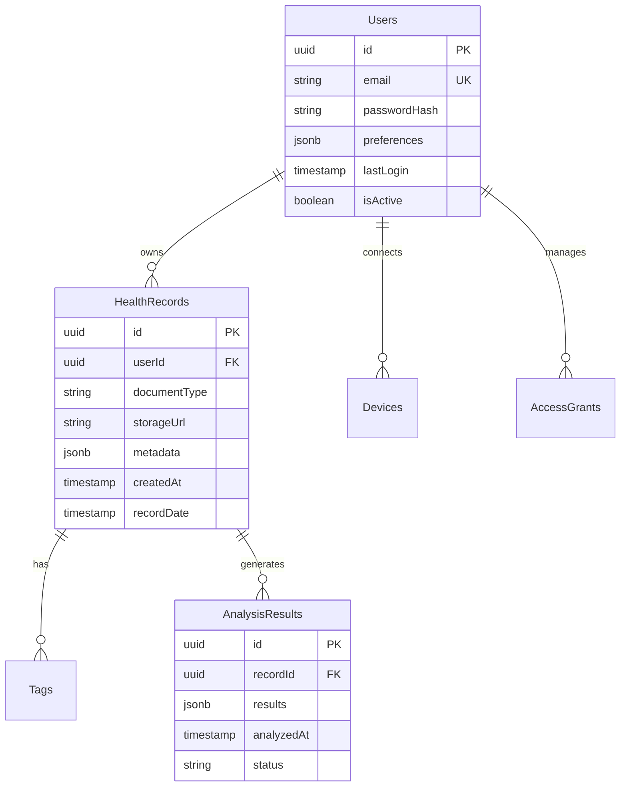

### 3.2.2 Data Management Strategy

| Aspect | Strategy | Implementation |
|--------|----------|----------------|
| Partitioning | Time-based partitioning | Monthly partitions for metrics |
| Indexing | B-tree + GiST indexes | Covering indexes for common queries |
| Archival | Cold storage after 2 years | AWS S3 Glacier |
| Backup | Continuous + Daily full | Multi-region replication |
| Encryption | AES-256 at rest | Field-level encryption for PHI |

### 3.2.3 Query Optimization

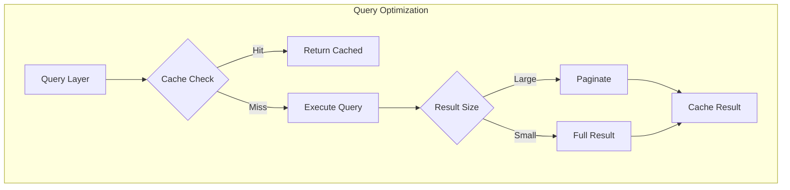

## 3.3 API DESIGN

### 3.3.1 API Architecture

| Component | Specification | Implementation |
|-----------|--------------|----------------|
| Protocol | REST + GraphQL | HTTPS only |
| Authentication | OAuth 2.0 + JWT | 1-hour token expiry |
| Rate Limiting | Token bucket | 1000 req/hour/user |
| Versioning | URI versioning | /api/v1/resource |
| Documentation | OpenAPI 3.0 | Auto-generated docs |

### 3.3.2 Endpoint Specifications

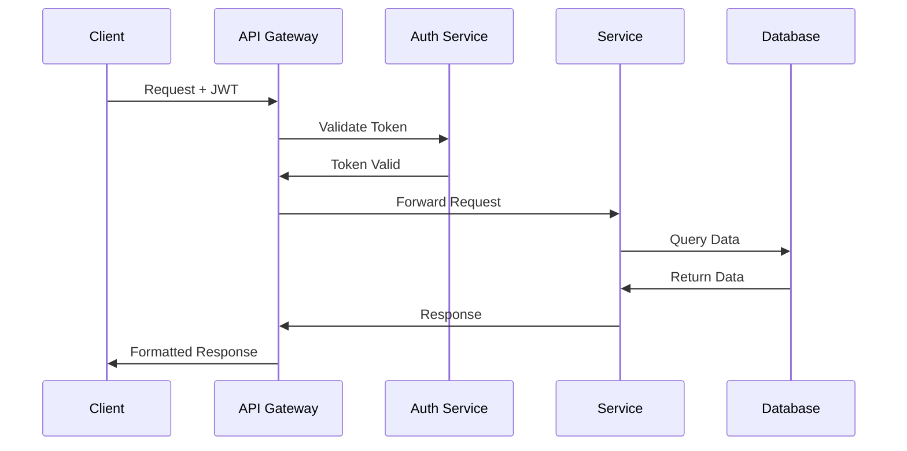

### 3.3.3 Integration Patterns

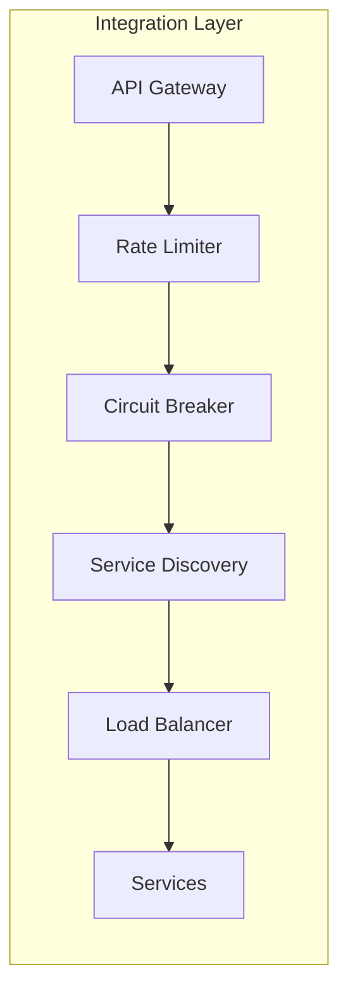

### 3.3.4 API Security Controls

| Control | Implementation | Purpose |
|---------|----------------|---------|
| TLS | TLS 1.3 only | Transport security |
| CORS | Whitelist domains | Cross-origin access |
| WAF | AWS WAF rules | Attack prevention |
| Throttling | Per-user/IP limits | DoS protection |
| Validation | JSON Schema | Input sanitization |
| Audit | Request logging | Compliance tracking |

# 4. TECHNOLOGY STACK

## 4.1 PROGRAMMING LANGUAGES

| Platform/Component | Language | Version | Justification |
|-------------------|----------|---------|---------------|
| Backend Services | Python | 3.11+ | - Native ML/AI library support<br>- Extensive healthcare data processing libraries<br>- Strong type hints support |
| Backend Performance Services | Go | 1.20+ | - High-performance API endpoints<br>- Efficient concurrent processing<br>- Low memory footprint |
| Web Frontend | TypeScript | 5.0+ | - Type safety for large-scale application<br>- Enhanced developer productivity<br>- Better maintainability |
| Mobile Apps | TypeScript (React Native) | 5.0+ | - Code sharing with web platform<br>- Strong typing for healthcare data models |
| iOS Native Modules | Swift | 5.8+ | - HealthKit native integration<br>- iOS platform optimization |
| Android Native Modules | Kotlin | 1.8+ | - Google Fit native integration<br>- Android platform optimization |

## 4.2 FRAMEWORKS & LIBRARIES

### Core Frameworks

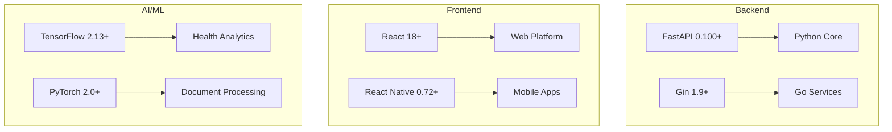

### Supporting Libraries

| Category | Library | Version | Purpose |
|----------|---------|---------|----------|
| API Documentation | OpenAPI | 3.0 | API specification and documentation |
| Authentication | Keycloak | 21.0+ | Identity and access management |
| State Management | Redux Toolkit | 1.9+ | Frontend state management |
| UI Components | Material-UI | 5.14+ | Consistent UI framework |
| Testing | Jest/PyTest | 29.0+/7.4+ | Unit and integration testing |
| Health Data | FHIR Client | 4.0+ | Healthcare data standard support |

## 4.3 DATABASES & STORAGE

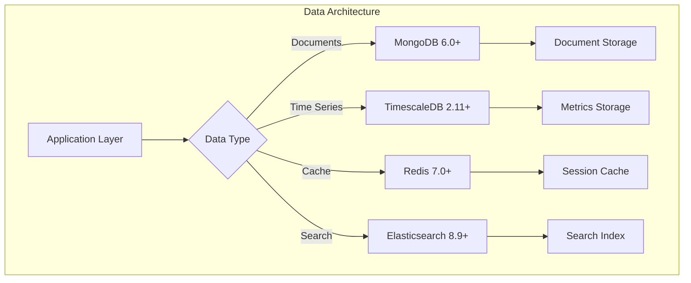

### Storage Strategy

| Data Type | Storage Solution | Justification |
|-----------|-----------------|---------------|
| Health Records | AWS S3 + MongoDB | HIPAA-compliant blob storage with metadata |
| User Data | MongoDB Atlas | Document flexibility, horizontal scaling |
| Time Series | TimescaleDB | Efficient health metrics storage |
| Search Index | Elasticsearch | Full-text search capabilities |
| Cache Layer | Redis Cluster | High-performance data caching |

## 4.4 THIRD-PARTY SERVICES

### Integration Architecture

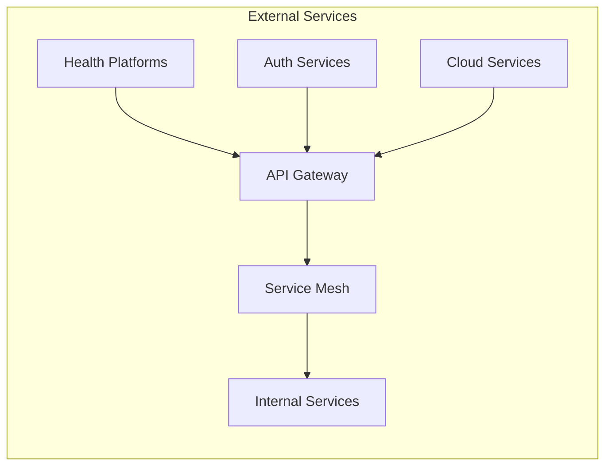

### Service Matrix

| Category | Service | Purpose | SLA Requirement |
|----------|---------|---------|-----------------|
| Authentication | Auth0 | Identity management | 99.99% uptime |
| OCR/Document | AWS Textract | Document processing | 99.9% accuracy |
| Analytics | Google Analytics 4 | Usage tracking | 99.9% uptime |
| Monitoring | DataDog | System monitoring | 99.99% uptime |
| Email | SendGrid | Notifications | 99.95% delivery |
| CDN | Cloudflare | Content delivery | 99.99% uptime |

## 4.5 DEVELOPMENT & DEPLOYMENT

### Development Pipeline

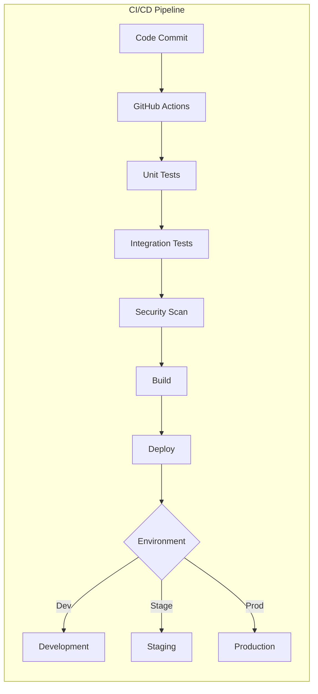

### Infrastructure Components

| Component | Technology | Version | Purpose |
|-----------|------------|---------|----------|
| Container Runtime | Docker | 24.0+ | Application containerization |
| Orchestration | Kubernetes | 1.27+ | Container orchestration |
| Service Mesh | Istio | 1.18+ | Microservices management |
| IaC | Terraform | 1.5+ | Infrastructure provisioning |
| Monitoring | Prometheus | 2.45+ | Metrics collection |
| Logging | ELK Stack | 8.9+ | Log aggregation |
| CI/CD | GitHub Actions | Latest | Automated pipeline |

# 5. SYSTEM DESIGN

## 5.1 USER INTERFACE DESIGN

### 5.1.1 Web Application Layout

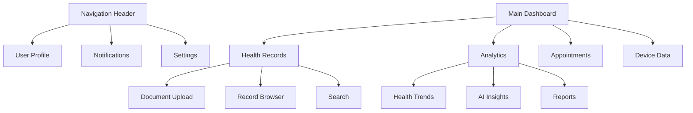

### 5.1.2 Mobile Application Layout

| Screen | Primary Components | Navigation |
|--------|-------------------|------------|
| Home | Health Summary, Quick Actions, Recent Records | Bottom Tab Bar |
| Records | Document List, Filter Panel, Upload Button | Hierarchical |
| Analytics | Charts, Metrics Cards, Insight Panels | Bottom Tab Bar |
| Profile | User Info, Settings, Device Management | Modal Screens |

### 5.1.3 Component Specifications

| Component | Behavior | Accessibility |
|-----------|----------|--------------|
| Document Viewer | Pinch-zoom, Rotate, Share | VoiceOver/TalkBack |
| Health Charts | Interactive tooltips, Time range selection | ARIA labels |
| Upload Interface | Drag-drop, Camera capture, Progress indicator | Keyboard navigation |
| Navigation Menu | Collapsible, Search, Quick actions | Screen reader support |

## 5.2 DATABASE DESIGN

### 5.2.1 Schema Architecture

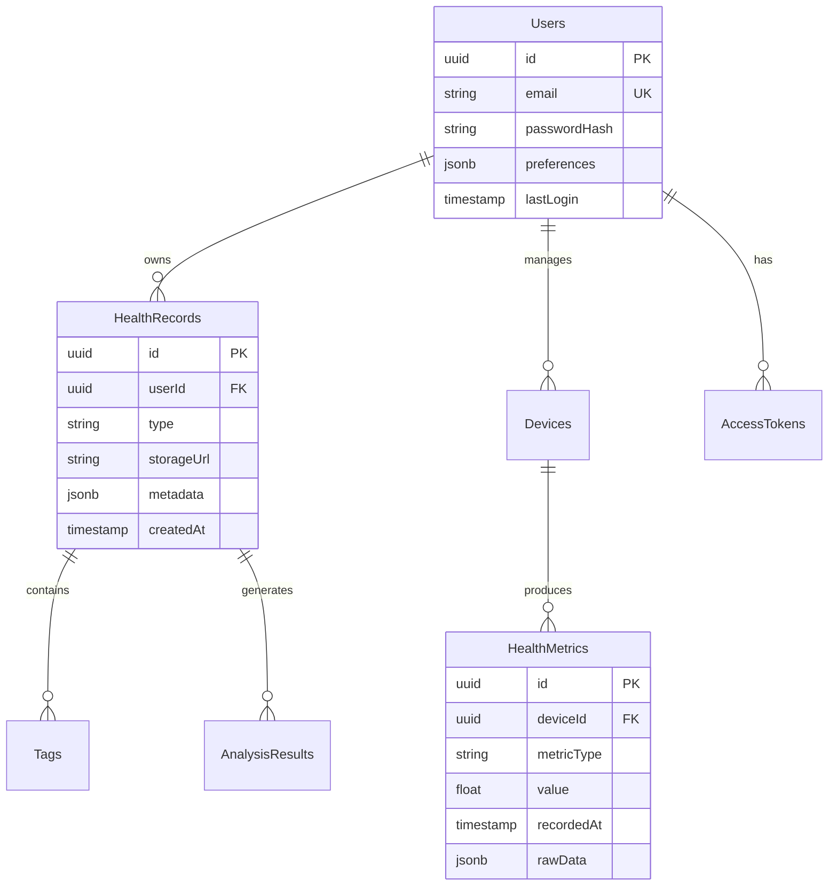

### 5.2.2 Data Storage Strategy

| Data Type | Storage Solution | Partitioning Strategy |
|-----------|-----------------|---------------------|
| User Data | MongoDB | Sharding by user ID |
| Health Records | AWS S3 + MongoDB | Time-based partitioning |
| Metrics | TimescaleDB | Hypertables by metric type |
| Analytics | Elasticsearch | Index per month |

### 5.2.3 Caching Architecture

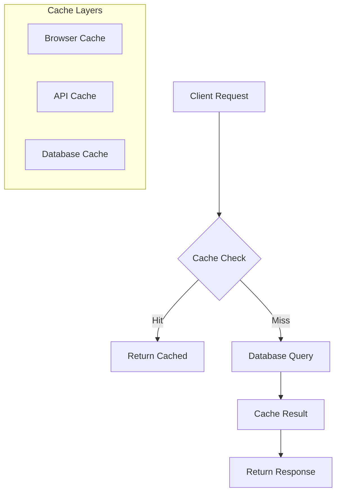

## 5.3 API DESIGN

### 5.3.1 REST API Endpoints

| Endpoint | Method | Purpose | Request Format |
|----------|--------|---------|----------------|
| /api/v1/health-records | POST | Upload record | Multipart/form-data |
| /api/v1/health-records | GET | List records | Query parameters |
| /api/v1/analytics | GET | Retrieve insights | JWT authentication |
| /api/v1/devices | PUT | Update device | JSON payload |

### 5.3.2 API Architecture

```mermaid
sequenceDiagram
    participant Client
    participant Gateway
    participant Auth
    participant Service
    participant Cache
    participant Database

    Client->>Gateway: API Request
    Gateway->>Auth: Validate Token
    Auth->>Gateway: Token Valid
    Gateway->>Cache: Check Cache
    alt Cache Hit
        Cache->>Gateway: Return Cached
    else Cache Miss
        Gateway->>Service: Process Request
        Service->>Database: Query Data
        Database->>Service: Return Data
        Service->>Cache: Update Cache
        Service->>Gateway: Return Response
    end
    Gateway->>Client: API Response
```

### 5.3.3 WebSocket Events

| Event | Direction | Payload | Purpose |
|-------|-----------|---------|---------|
| health.metric.update | Server→Client | MetricData | Real-time metric updates |
| analysis.complete | Server→Client | AnalysisResult | Analysis completion notification |
| device.sync | Client→Server | DeviceData | Device data synchronization |
| record.processed | Server→Client | RecordStatus | Document processing status |

### 5.3.4 API Security

```mermaid
graph TD
    A[API Request] --> B[Rate Limiting]
    B --> C[JWT Validation]
    C --> D[RBAC Check]
    D --> E[Input Validation]
    E --> F[Processing]
    F --> G[Response Encryption]
    G --> H[API Response]
```

# 6. USER INTERFACE DESIGN

## 6.1 Design System

### 6.1.1 Component Library Key
```
Icons:
[?] - Help/Information tooltip
[$] - Payment/Financial information
[i] - Information
[+] - Add new item
[x] - Close/Delete
[<] [>] - Navigation arrows
[^] - Upload
[#] - Dashboard/Menu
[@] - User profile
[!] - Alert/Warning
[=] - Settings menu
[*] - Favorite/Important

Interactive Elements:
[ ] - Checkbox
( ) - Radio button
[Button] - Clickable button
[...] - Text input field
[====] - Progress indicator
[v] - Dropdown menu

Layout:
+--+ - Container border
|  | - Vertical separator
+-- - Hierarchical relationship
```

## 6.2 Core Screens

### 6.2.1 Main Dashboard
```
+----------------------------------------------------------+
|  [#] PHRSAT    [@] John Doe    [?] Help    [=] Settings  |
+----------------------------------------------------------+
|  +----------------+  +----------------+  +----------------+|
|  | Health Summary |  | Recent Records |  |  Appointments  ||
|  |  HR: 75 bpm    |  | [*] Lab Test  |  | Today         ||
|  |  BP: 120/80    |  | [i] X-Ray     |  | [!] 2:30 PM   ||
|  |  Steps: 8,542  |  | [i] MRI Scan  |  | Tomorrow      ||
|  | [>] Details    |  | [>] View All  |  | [+] Schedule  ||
|  +----------------+  +----------------+  +----------------+|
|                                                          |
|  +--------------------------------------------------+   |
|  | Health Trends                                     |   |
|  | [====================================]           |   |
|  | Weekly Activity Score: 85%                       |   |
|  | [v] Select Metric                                |   |
|  +--------------------------------------------------+   |
+----------------------------------------------------------+
```

### 6.2.2 Record Upload Interface
```
+----------------------------------------------------------+
|  [<] Back    Document Upload    [@] John Doe    [=] Menu  |
+----------------------------------------------------------+
|                                                          |
|  +--------------------------------------------------+   |
|  |                   Drop Files Here                 |   |
|  |                         or                        |   |
|  |                  [^] Choose File                  |   |
|  +--------------------------------------------------+   |
|                                                          |
|  Document Type: [v] Select Type                         |
|  Date: [...................] (MM/DD/YYYY)               |
|  Tags: [...................] [+] Add Tag                |
|                                                          |
|  [ ] Add to favorites                                    |
|  [ ] Share with healthcare provider                      |
|                                                          |
|  [Cancel]                     [Upload Document]          |
+----------------------------------------------------------+
```

### 6.2.3 Health Analytics View
```
+----------------------------------------------------------+
|  [<] Back    Health Analytics    [@] John Doe    [=] Menu |
+----------------------------------------------------------+
|  +----------------+  +--------------------------------+   |
|  | Time Range:    |  | Metric Selection:              |   |
|  | ( ) 1 Week     |  | [x] Heart Rate                |   |
|  | ( ) 1 Month    |  | [x] Blood Pressure            |   |
|  | (*) 3 Months   |  | [ ] Sleep Quality             |   |
|  | ( ) Custom     |  | [ ] Activity Level            |   |
|  +----------------+  +--------------------------------+   |
|                                                          |
|  +--------------------------------------------------+   |
|  | Trend Analysis                                    |   |
|  |                                                   |   |
|  |    ^                                             |   |
|  |    |      .    .    .    .    .   .             |   |
|  |    |    .   .   .  .  .   .  .   .              |   |
|  |    +-------------------------------------->      |   |
|  |                                                   |   |
|  +--------------------------------------------------+   |
|                                                          |
|  [Export Data]    [Share Report]    [Save Analysis]     |
+----------------------------------------------------------+
```

### 6.2.4 Mobile Navigation Menu
```
+------------------+
| [@] John Doe     |
| [i] Basic Plan   |
+------------------+
| [#] Dashboard    |
| [^] Upload       |
| [i] Records      |
| [*] Favorites    |
| [$] Billing      |
| [?] Support      |
| [=] Settings     |
+------------------+
| [!] Updates      |
| Version 2.1.0    |
+------------------+
```

## 6.3 Responsive Breakpoints

### 6.3.1 Layout Grid
```
Desktop (>1024px)
+--------+--------+--------+
|   1/3  |   1/3  |   1/3  |
+--------+--------+--------+

Tablet (768-1024px)
+--------+--------+
|   1/2  |   1/2  |
+--------+--------+

Mobile (<768px)
+----------------+
|      100%      |
+----------------+
```

### 6.3.2 Component Adaptation
```
Navigation:
Desktop: |[#] [i] [*] [$] [=]|
Tablet:  |[#] [=] [......]  >|
Mobile:  |[#] [=]|

Content Cards:
Desktop: |Card| |Card| |Card|
Tablet:  |Card| |Card|
         |Card| |Card|
Mobile:  |Card|
         |Card|
         |Card|
```

## 6.4 Interaction States

### 6.4.1 Button States
```
Normal:    [   Button   ]
Hover:     [  >Button<  ]
Active:    [ >>Button<< ]
Disabled:  [---Button---]
Loading:   [====Button==]
```

### 6.4.2 Form Validation
```
Valid:     [...........] [✓]
Invalid:   [...........] [!]
Required:  [...........]*
Disabled:  [----------]
```

### 6.4.3 Alert Types
```
Success:   [✓] Operation completed successfully
Warning:   [!] Please review your information
Error:     [x] An error occurred. Please try again
Info:      [i] New features available
```

# 7. SECURITY CONSIDERATIONS

## 7.1 AUTHENTICATION AND AUTHORIZATION

### 7.1.1 Authentication Methods

| Method | Implementation | Use Case |
|--------|----------------|-----------|
| OAuth 2.0 + OIDC | Auth0/Keycloak | Primary authentication |
| Multi-Factor Authentication | Time-based OTP | Additional security layer |
| Biometric | TouchID/FaceID | Mobile app authentication |
| Social Sign-in | Google, Apple | Alternative authentication |
| JWT | RS256 algorithm | Session management |

### 7.1.2 Authorization Model

```mermaid
graph TD
    A[User Request] --> B{Authentication}
    B -->|Valid| C[Role Check]
    B -->|Invalid| D[Login Required]
    C --> E{Permission Check}
    E -->|Authorized| F[Access Granted]
    E -->|Unauthorized| G[Access Denied]
    
    subgraph Roles
    H[Admin]
    I[Healthcare Provider]
    J[Patient]
    K[Family Caregiver]
    end
```

### 7.1.3 Role-Based Access Control Matrix

| Resource | Admin | Healthcare Provider | Patient | Family Caregiver |
|----------|-------|-------------------|---------|------------------|
| View Records | Full | Granted | Own Only | Delegated |
| Upload Records | Yes | Yes | Yes | Limited |
| Delete Records | Yes | No | Own Only | No |
| Share Records | Yes | Limited | Yes | Limited |
| System Config | Yes | No | No | No |

## 7.2 DATA SECURITY

### 7.2.1 Encryption Standards

```mermaid
graph TB
    subgraph Data States
    A[Data in Transit] --> B[TLS 1.3]
    C[Data at Rest] --> D[AES-256-GCM]
    E[Data in Use] --> F[Memory Encryption]
    end
    
    subgraph Key Management
    G[AWS KMS] --> H[Key Rotation]
    H --> I[Access Control]
    I --> J[Audit Logging]
    end
```

### 7.2.2 PHI Protection Measures

| Data Type | Protection Method | Backup Strategy |
|-----------|------------------|-----------------|
| Medical Records | Field-level encryption | Geo-redundant |
| Personal Info | Tokenization | Daily encrypted |
| Genetic Data | Homomorphic encryption | Cold storage |
| Payment Info | PCI DSS compliance | Secure vault |

### 7.2.3 Data Loss Prevention

```mermaid
flowchart LR
    A[Data Access] --> B{DLP Check}
    B -->|Sensitive| C[Encrypt]
    B -->|Non-sensitive| D[Allow]
    C --> E{Policy Check}
    E -->|Compliant| F[Transfer]
    E -->|Non-compliant| G[Block]
```

## 7.3 SECURITY PROTOCOLS

### 7.3.1 Network Security

| Layer | Protocol/Method | Implementation |
|-------|----------------|----------------|
| Edge | CloudFlare WAF | DDoS protection |
| Transport | TLS 1.3 | Strict HTTPS |
| API | OAuth 2.0 + CORS | API security |
| Database | IP whitelisting | Access control |

### 7.3.2 Security Monitoring

```mermaid
graph TD
    A[Security Events] --> B[ELK Stack]
    A --> C[Prometheus]
    B --> D[SIEM]
    C --> D
    D --> E[Alert System]
    E --> F[Security Team]
    E --> G[Automated Response]
```

### 7.3.3 Compliance Controls

| Requirement | Implementation | Monitoring |
|-------------|----------------|------------|
| HIPAA | PHI encryption | Access logs |
| GDPR | Data sovereignty | Consent tracking |
| HITECH | Breach notification | Incident response |
| SOC 2 | Security controls | Continuous audit |

### 7.3.4 Security Testing

```mermaid
graph LR
    subgraph Security Testing Cycle
    A[Static Analysis] --> B[Dynamic Testing]
    B --> C[Penetration Testing]
    C --> D[Vulnerability Scan]
    D --> E[Security Review]
    E --> A
    end
```

### 7.3.5 Incident Response

| Phase | Actions | Responsible Team |
|-------|---------|-----------------|
| Detection | Monitor alerts, Log analysis | Security Operations |
| Containment | Isolate systems, Block access | Infrastructure Team |
| Eradication | Remove threat, Patch systems | Security Team |
| Recovery | Restore services, Verify integrity | Operations Team |
| Lessons Learned | Update procedures, Enhance controls | All Teams |

# 8. INFRASTRUCTURE

## 8.1 DEPLOYMENT ENVIRONMENT

The PHRSAT system utilizes a cloud-native architecture with geographic redundancy across multiple regions.

### Primary Environment Configuration

| Component | Environment | Justification |
|-----------|------------|---------------|
| Production | Multi-region Cloud | High availability, global scalability |
| Staging | Single-region Cloud | Cost-effective pre-production testing |
| Development | Containerized Local/Cloud | Developer flexibility, cost control |
| DR Site | Secondary Cloud Region | Business continuity, compliance |

### Regional Distribution

```mermaid
graph TB
    subgraph Primary Region
    A[Load Balancer] --> B[Application Cluster]
    B --> C[Primary Database]
    B --> D[Cache Layer]
    end
    
    subgraph DR Region
    E[Standby Load Balancer] --> F[Standby Cluster]
    F --> G[Replica Database]
    F --> H[Replica Cache]
    end
    
    subgraph Edge Locations
    I[CloudFront/CDN]
    J[WAF]
    end
    
    I --> A
    I --> E
    J --> I
```

## 8.2 CLOUD SERVICES

### Core Infrastructure Services

| Service | Provider | Purpose | Tier/Configuration |
|---------|----------|---------|-------------------|
| Compute | AWS EKS | Container orchestration | Production: r5.xlarge |
| Storage | AWS S3 | Document storage | Standard + Glacier |
| CDN | CloudFront | Global content delivery | 50TB transfer/month |
| DNS | Route 53 | DNS management | Latency-based routing |
| WAF | AWS WAF | Web application firewall | Enterprise rules |

### Database Services

| Service | Provider | Purpose | Configuration |
|---------|----------|---------|---------------|
| MongoDB Atlas | AWS | User data, metadata | M40 dedicated cluster |
| Amazon TimescaleDB | AWS | Time-series health data | r5.2xlarge |
| ElastiCache | AWS | Session management | r6g.xlarge |
| OpenSearch | AWS | Full-text search | 3-node cluster |

## 8.3 CONTAINERIZATION

### Container Architecture

```mermaid
graph TD
    subgraph Container Registry
    A[ECR] --> B[Base Images]
    A --> C[Application Images]
    A --> D[Utility Images]
    end
    
    subgraph Container Types
    E[Frontend Container]
    F[API Container]
    G[Worker Container]
    H[Analytics Container]
    end
    
    B --> E
    B --> F
    B --> G
    B --> H
```

### Docker Configuration

| Image Type | Base Image | Resource Limits |
|------------|------------|-----------------|
| Frontend | node:18-alpine | 1CPU, 2GB RAM |
| API Services | python:3.11-slim | 2CPU, 4GB RAM |
| Workers | python:3.11-slim | 2CPU, 8GB RAM |
| Analytics | tensorflow/tensorflow:2.13.0 | 4CPU, 16GB RAM |

## 8.4 ORCHESTRATION

### Kubernetes Architecture

```mermaid
graph TB
    subgraph EKS Cluster
    A[Ingress Controller] --> B[Service Mesh]
    B --> C[Application Pods]
    B --> D[Worker Pods]
    
    C --> E[HPA]
    D --> F[VPA]
    
    G[ConfigMaps] --> C
    H[Secrets] --> C
    end
    
    subgraph Monitoring
    I[Prometheus]
    J[Grafana]
    K[AlertManager]
    end
    
    C --> I
    D --> I
    I --> J
    I --> K
```

### Cluster Configuration

| Component | Configuration | Scaling Policy |
|-----------|--------------|----------------|
| API Nodes | r5.xlarge | HPA: 3-15 pods |
| Worker Nodes | c5.2xlarge | VPA: 2-10 pods |
| Analytics Nodes | p3.2xlarge | HPA: 1-5 pods |
| System Nodes | t3.large | Static: 2 pods |

## 8.5 CI/CD PIPELINE

### Pipeline Architecture

```mermaid
graph LR
    subgraph Development
    A[Code Commit] --> B[Unit Tests]
    B --> C[Build]
    C --> D[Integration Tests]
    end
    
    subgraph Security
    D --> E[SAST]
    E --> F[Container Scan]
    F --> G[SCA]
    end
    
    subgraph Deployment
    G --> H[Staging Deploy]
    H --> I[E2E Tests]
    I --> J[Production Deploy]
    end
```

### Pipeline Components

| Stage | Tool | Configuration |
|-------|------|--------------|
| Source Control | GitHub Enterprise | Branch protection, signed commits |
| CI Pipeline | GitHub Actions | Self-hosted runners |
| Artifact Storage | AWS ECR | Immutable tags |
| Infrastructure as Code | Terraform | Remote state in S3 |
| Secret Management | AWS Secrets Manager | Automatic rotation |
| Monitoring | DataDog | Full stack monitoring |

### Deployment Strategy

| Environment | Strategy | Rollback Time |
|-------------|----------|---------------|
| Production | Blue-Green | < 5 minutes |
| Staging | Rolling Update | < 2 minutes |
| Development | Direct Deploy | Immediate |
| DR | Pilot Light | < 15 minutes |

# APPENDICES

## A.1 ADDITIONAL TECHNICAL INFORMATION

### A.1.1 Health Data Format Standards

| Standard | Implementation | Use Case |
|----------|----------------|----------|
| FHIR R4 | JSON/XML | Healthcare data exchange |
| DICOM 3.0 | Binary | Medical imaging |
| HL7 v2.x | Pipe-delimited | Legacy system integration |
| CDA R2 | XML | Clinical documents |

### A.1.2 Machine Learning Model Specifications

```mermaid
graph TD
    A[Input Layer] --> B[Feature Extraction]
    B --> C{Model Type}
    C -->|Document Classification| D[CNN]
    C -->|Time Series Analysis| E[LSTM]
    C -->|Health Predictions| F[Random Forest]
    D --> G[Output Layer]
    E --> G
    F --> G
    G --> H[Post-processing]
```

### A.1.3 Backup and Recovery Procedures

| Component | Backup Method | Recovery Time Objective | Recovery Point Objective |
|-----------|--------------|-------------------------|-------------------------|
| User Data | Continuous replication | 4 hours | 5 minutes |
| Documents | Daily incremental | 8 hours | 24 hours |
| Analytics | Weekly full backup | 24 hours | 1 week |
| Configuration | Version controlled | 1 hour | 1 hour |

## A.2 GLOSSARY

| Term | Definition |
|------|------------|
| Access Control List (ACL) | Security mechanism that controls access to system resources |
| Blue-Green Deployment | Deployment strategy using two identical environments for zero-downtime updates |
| Circuit Breaker | Design pattern that prevents cascading failures in distributed systems |
| Data Lake | Storage repository holding raw data in native format until needed |
| Edge Computing | Distributed computing paradigm bringing computation closer to data sources |
| Feature Flag | Configuration mechanism enabling dynamic feature activation/deactivation |
| Health Metric | Quantifiable measure of health status or activity |
| Immutable Infrastructure | Infrastructure that is never modified after deployment |
| JWT Claims | Statements about an entity and metadata in JSON Web Tokens |
| Kubernetes Pod | Smallest deployable unit in Kubernetes containing containers |
| Load Balancer | Device distributing network traffic across multiple servers |
| Microservices | Architectural style structuring applications as service collections |
| Node Affinity | Kubernetes feature controlling pod placement on specific nodes |
| OAuth Scope | Parameter defining access boundaries in OAuth authorization |
| PHI (Protected Health Information) | Any health information that can identify an individual |
| Queue Worker | Process handling background tasks from a message queue |
| Rate Limiting | Technique controlling request frequency to an API |
| Service Mesh | Infrastructure layer handling service-to-service communication |
| Time Series Database | Database optimized for time-stamped or sequential data |
| WebSocket | Protocol providing full-duplex communication channels |

## A.3 ACRONYMS

| Acronym | Full Form |
|---------|-----------|
| AES | Advanced Encryption Standard |
| API | Application Programming Interface |
| AWS | Amazon Web Services |
| BLOB | Binary Large Object |
| CDN | Content Delivery Network |
| CORS | Cross-Origin Resource Sharing |
| DDoS | Distributed Denial of Service |
| ELK | Elasticsearch, Logstash, Kibana |
| FHIR | Fast Healthcare Interoperability Resources |
| GDPR | General Data Protection Regulation |
| HIPAA | Health Insurance Portability and Accountability Act |
| HITECH | Health Information Technology for Economic and Clinical Health Act |
| HPA | Horizontal Pod Autoscaler |
| IaC | Infrastructure as Code |
| JWT | JSON Web Token |
| K8s | Kubernetes |
| MTBF | Mean Time Between Failures |
| MTTR | Mean Time To Recovery |
| NLP | Natural Language Processing |
| OCR | Optical Character Recognition |
| OIDC | OpenID Connect |
| PHI | Protected Health Information |
| RBAC | Role-Based Access Control |
| REST | Representational State Transfer |
| RTO | Recovery Time Objective |
| S3 | Simple Storage Service |
| SAST | Static Application Security Testing |
| SCA | Software Composition Analysis |
| SIEM | Security Information and Event Management |
| SOC | System and Organization Controls |
| SSL | Secure Sockets Layer |
| TLS | Transport Layer Security |
| VPA | Vertical Pod Autoscaler |
| WAF | Web Application Firewall |
| WCAG | Web Content Accessibility Guidelines |
| XSS | Cross-Site Scripting |