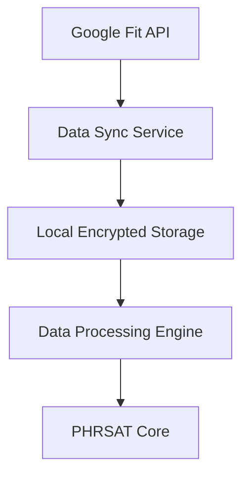

# PHRSAT Android Native Module

## Overview
The PHRSAT Android native module provides a high-performance, HIPAA-compliant implementation for health data management and Google Fit integration. This module is built using Kotlin 1.8+ and follows enterprise-grade security and performance optimization standards.

## Table of Contents
- [Security Implementation](#security-implementation)
- [Performance Optimization](#performance-optimization)
- [Setup and Configuration](#setup-and-configuration)
- [Integration Guidelines](#integration-guidelines)
- [Testing](#testing)
- [Maintenance](#maintenance)

## Security Implementation

### HIPAA Compliance
- AES-256 encryption for data at rest
- TLS 1.3 for data in transit
- Secure key storage using Android Keystore
- PHI data isolation and access control
- Audit logging for all data access

### Biometric Authentication
```kotlin
// Implementation via BiometricManager.kt
// Supports Fingerprint, Face Recognition, and Iris scanning
BiometricManager.authenticate(
    title = "PHRSAT Authentication",
    subtitle = "Verify your identity to access health records",
    negativeButtonText = "Cancel",
    allowDeviceCredential = false
)
```

### Secure Storage
- Encrypted SharedPreferences for sensitive data
- File-level encryption for health records
- Secure backup mechanisms
- Automatic data purge on unauthorized access attempts

## Performance Optimization

### Background Sync Configuration
```kotlin
// Optimized WorkManager configuration
val syncConstraints = Constraints.Builder()
    .setRequiredNetworkType(NetworkType.CONNECTED)
    .setRequiresBatteryNotLow(true)
    .build()

val syncWork = PeriodicWorkRequestBuilder<HealthDataSyncWorker>(
    repeatInterval = 15,
    repeatIntervalTimeUnit = TimeUnit.MINUTES
).setConstraints(syncConstraints)
 .build()
```

### Resource Management
- Adaptive batch sizes for data synchronization
- Memory-efficient data processing
- Background task prioritization
- Cache optimization strategies

### Battery Optimization
- Intelligent sync scheduling
- Batch processing for network operations
- Efficient wake lock management
- Power-conscious location updates

## Setup and Configuration

### Environment Requirements
- Android Studio Arctic Fox or later
- Kotlin 1.8+
- Minimum SDK: API 24
- Target SDK: API 33
- Google Play Services 21.0.0+

### Build Configuration
```groovy
// build.gradle
buildscript {
    ext.kotlin_version = '1.8.0'
    ext.google_fit_version = '21.0.0'
    ext.security_crypto_version = '1.1.0-alpha06'
}

// app/build.gradle
dependencies {
    implementation "org.jetbrains.kotlin:kotlin-stdlib:$kotlin_version"
    implementation "com.google.android.gms:play-services-fitness:$google_fit_version"
    implementation "androidx.security:security-crypto:$security_crypto_version"
}
```

### Google Fit Integration
```kotlin
// Initialize Google Fit client
GoogleFitManager.initialize(
    context = applicationContext,
    scopes = listOf(
        Fitness.SCOPE_ACTIVITY_READ,
        Fitness.SCOPE_BODY_READ,
        Fitness.SCOPE_HEART_RATE_READ
    )
)
```

## Integration Guidelines

### Data Flow Architecture


### Error Handling
- Comprehensive exception handling
- Graceful degradation strategies
- Automatic retry mechanisms
- User-friendly error messages

## Testing

### Security Testing
```bash
# Run security tests
./gradlew :app:testSecurityDebug

# Perform security analysis
./gradlew dependencyCheckAnalyze
```

### Performance Testing
```bash
# Run performance tests
./gradlew :app:benchmarkDebug

# Generate performance report
./gradlew performanceReport
```

## Maintenance

### Version Control
- Semantic versioning (MAJOR.MINOR.PATCH)
- Changelog maintenance
- Deprecation policies
- Migration guides

### Review Cycles
- Security review: Monthly
- Performance review: Quarterly
- Code review: Continuous
- Dependency updates: Monthly

### Monitoring
- Crash reporting via Firebase Crashlytics
- Performance monitoring via Firebase Performance
- Security incident tracking
- Usage analytics

## Contributing
Please refer to CONTRIBUTING.md for guidelines on contributing to this module.

## License
Copyright © 2023 PHRSAT. All rights reserved.