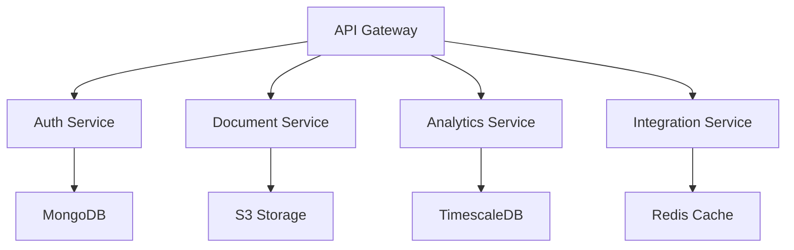
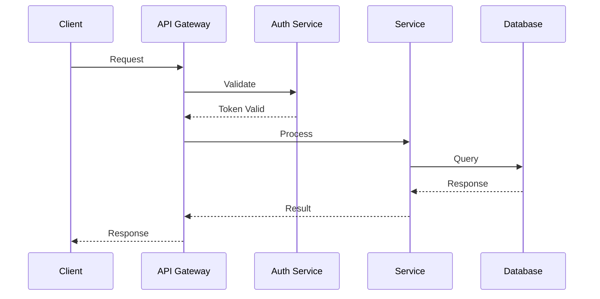

# PHRSAT Backend Services

Enterprise-grade backend services for the Personal Health Record Store and Analysis Tool (PHRSAT), implementing a secure, scalable, and HIPAA-compliant microservices architecture.

## Overview

PHRSAT backend implements a distributed microservices architecture using Python 3.11+ with FastAPI, providing:

- Secure health record management and storage
- AI/ML-powered health analytics
- Real-time data processing pipelines
- HIPAA-compliant security framework
- Scalable cloud-native deployment

### System Architecture


## Prerequisites

- Python 3.11+
- Docker 24.0+ and Docker Compose 2.20+
- Make utility
- AWS CLI with configured credentials
- kubectl 1.27+ for Kubernetes deployment
- Development tools (git, poetry)
- Security certificates and keys
- Database client tools

## Getting Started

1. Clone the repository and set up environment:
```bash
# Create and activate virtual environment
python -m venv venv
source venv/bin/activate  # Unix
.\venv\Scripts\activate   # Windows

# Install dependencies
make install-dev
```

2. Configure environment variables:
```bash
cp .env.example .env
# Edit .env with your configuration
```

3. Start development environment:
```bash
make docker-build
make docker-up
make init-db
```

4. Verify installation:
```bash
make test
make lint
```

## Architecture

### Microservices Components

- **Auth Service**: OAuth2/JWT authentication, RBAC
- **Document Service**: Health record processing, OCR
- **Analytics Service**: ML-powered health insights
- **Integration Service**: External API integration

### Data Flow


## Development

### Code Style

- Follow PEP 8 guidelines
- Mandatory type hints (Python 3.11+)
- Docstring for all public APIs
- 100% test coverage requirement

### Commands

```bash
# Development
make lint          # Run linters
make test         # Run tests
make coverage     # Generate coverage report
make format       # Format code
make docs         # Generate API documentation

# Deployment
make build-prod   # Build production images
make deploy-staging
make deploy-prod
make rollback
```

## Deployment

### Production Deployment

1. Build production images:
```bash
make build-prod
```

2. Deploy to Kubernetes:
```bash
kubectl apply -f kubernetes/
```

3. Verify deployment:
```bash
kubectl get pods
kubectl get services
```

### Environment Variables

| Variable | Description | Required | Default |
|----------|-------------|----------|---------|
| ENVIRONMENT | Runtime environment | Yes | - |
| DEBUG | Enable debug mode | No | false |
| LOG_LEVEL | Logging verbosity | No | INFO |
| DATABASE_URL | Database connection | Yes | - |
| REDIS_URL | Redis connection | Yes | - |
| AWS_ACCESS_KEY_ID | AWS access key | Yes | - |
| AWS_SECRET_ACCESS_KEY | AWS secret key | Yes | - |
| JWT_SECRET | JWT signing key | Yes | - |
| API_RATE_LIMIT | Requests per minute | No | 100 |

## API Documentation

- OpenAPI documentation available at `/docs`
- Authentication using OAuth2/JWT
- Rate limiting: 100 requests/minute default
- All endpoints versioned: `/api/v1/`

## Testing

### Test Suites

- Unit tests: `tests/unit/`
- Integration tests: `tests/integration/`
- Performance tests: `tests/performance/`
- Security tests: `tests/security/`

### Running Tests

```bash
# Run all tests
make test

# Run specific suite
make test-unit
make test-integration
make test-performance
make test-security

# Generate coverage report
make coverage
```

## Dependencies

### Runtime Requirements

- Python >= 3.11
- Docker >= 24.0.0
- Docker Compose >= 2.20.0
- kubectl >= 1.27.0

### Core Services

- MongoDB 6.0
- TimescaleDB 2.11
- Redis 7.0
- Elasticsearch 8.9.0
- Prometheus 2.45.0
- Grafana 10.0.0

### Key Frameworks

- FastAPI 0.100.0
- TensorFlow 2.13.0
- PyTorch 2.0.0
- SQLAlchemy 2.0.0
- Pydantic 2.0.0

## Security

- HIPAA compliance enforced
- End-to-end encryption
- Role-based access control
- Audit logging
- Regular security scanning
- Automated vulnerability assessment

## License

Copyright © 2023 PHRSAT. All rights reserved.